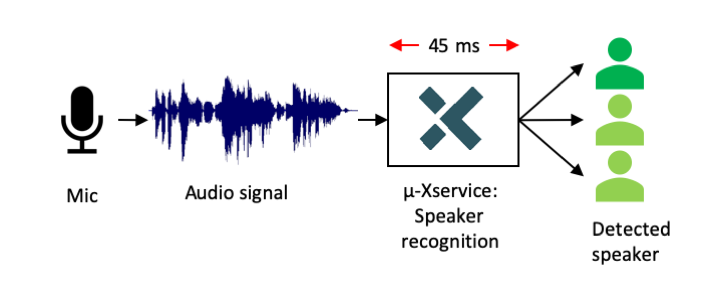

# Speaker Recognition Demo

The Speaker Recognition u-Xservice demo allows to identify an individual based on his voice.

The interface of the demo is a http server (u-Xservice) listening on port 8088.
To start a speaker's detection request send an input tensor (png format) as POST request to the API.
The classification result is a json array containing the predicted probabilities.

Contact Xelera at <info@xelera.io> and ask access to the Speaker Recognition u-Xservice demo for AWS.

## Supported Platforms

|            Board            |
| :-------------------------: |
|   [AWS F1 instances](/aws) |
